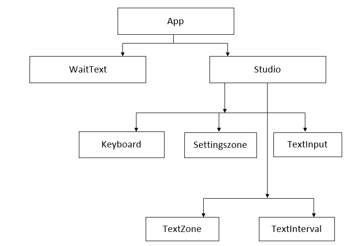

# `Keyboard Typing App`
This App enable user to training on keyboard typing in two options:
* Insert a text and training to typing it 
* Training to typing letters.
 
`Nbr:` the Keyboard used is Querty.
## `Technologies`
In this App is created by React js we use : 
* React Js
* Redux 
* Css for styling 
___

## Aditional options :
This App allows to
* Switch style mode (Dark-Light).
* Chose the color for the current word in typing.
* Select the fast of release letters.

Nbr: Parameters are saved in the browser localstorage.
___
## How the app is building 

### Routes:
this app use the library **react-router-dom** to handle routes:
* / ==> the index page 
* /text ===> page to training on typing text
* /interval ===> page to training on typing letters
  
### Directories structure
```
   public
   src
     components
     store
     style
       media
```
___
## Components Tree:
 

___
## `Run App`
This App run with React js by
```
npx create-react-app Keyboard 
```